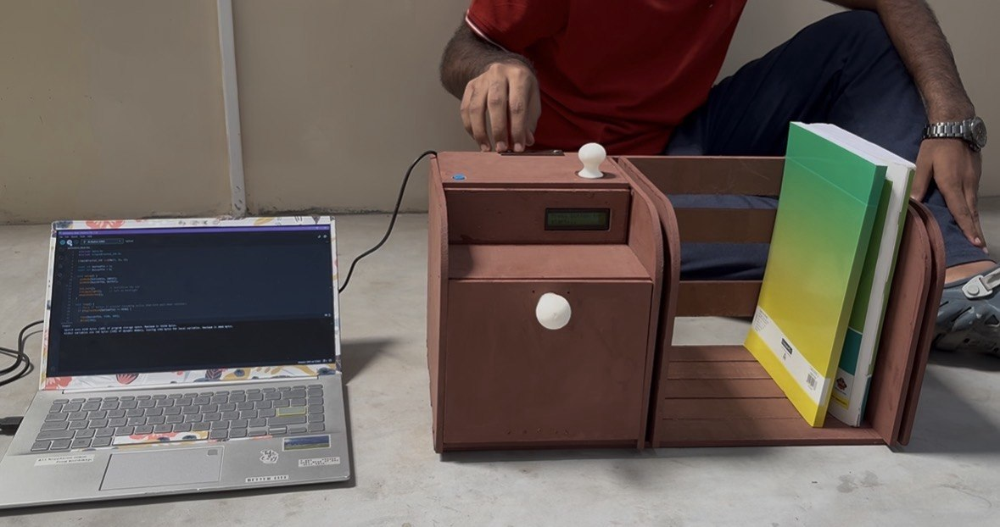
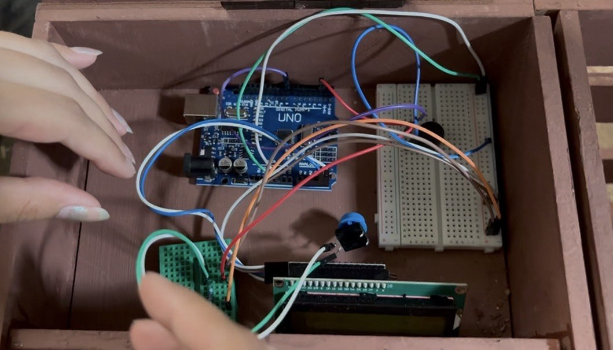
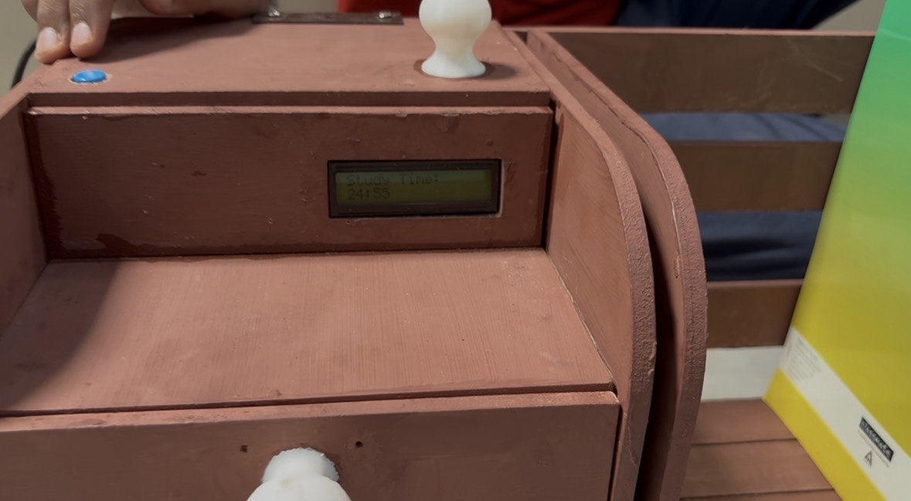
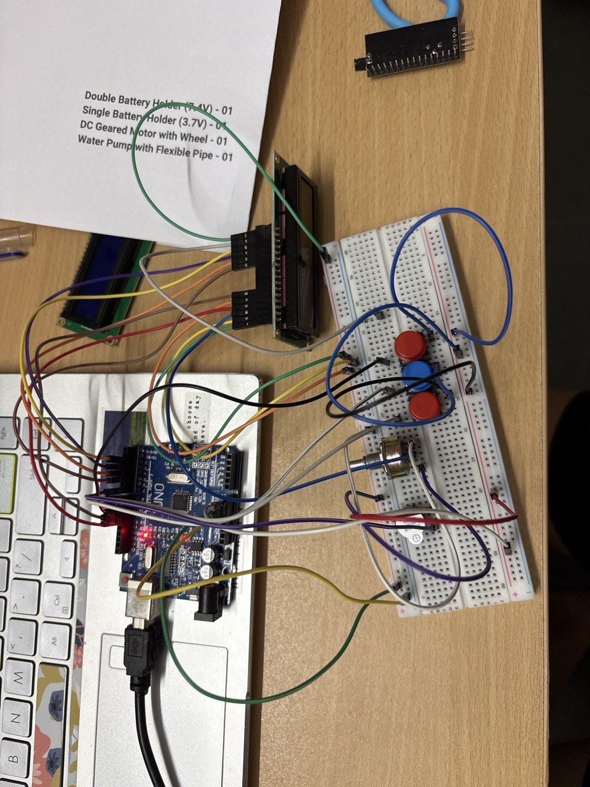

Pomodoro Timer for Expandable Bookshelf 

Overview:

This project was developed during my first year engineering protoyping course as a feature integrated into an expandable bookshelf. The bookshelf included a storage drawer above which the Pomodoro timer module was added to encourage focused study sessions and improve productivity while using the bookshelf.
The project combined basic electronics, embedded programming and product design considerations.

Final Design:

The final version consisted of:

    Arduino UNO
    I2C LCD display for time
    Piezo buzzer for session notification
    Push button to start the timer

The timer by default has a 25-minute study window and a 5-minute rest window, the buzzer notifies when the session starts, stops; rest starts and stops with different sounds. One cycle follows after which you have to press the button to restart the loop, keeping the user interface simple and intuitive.

Design Iterations:

Severals versions of the timer were developed during the prototyping process. Early designs explored different interfaces and hardware arrangements. Through testing and feedback from my group members, I removed the unnecessary complexity and simplified the design.

The final version prioritized:

    Ease of use
    Minimal hardware
    Clear visual feedback
    Reliable operation

    
